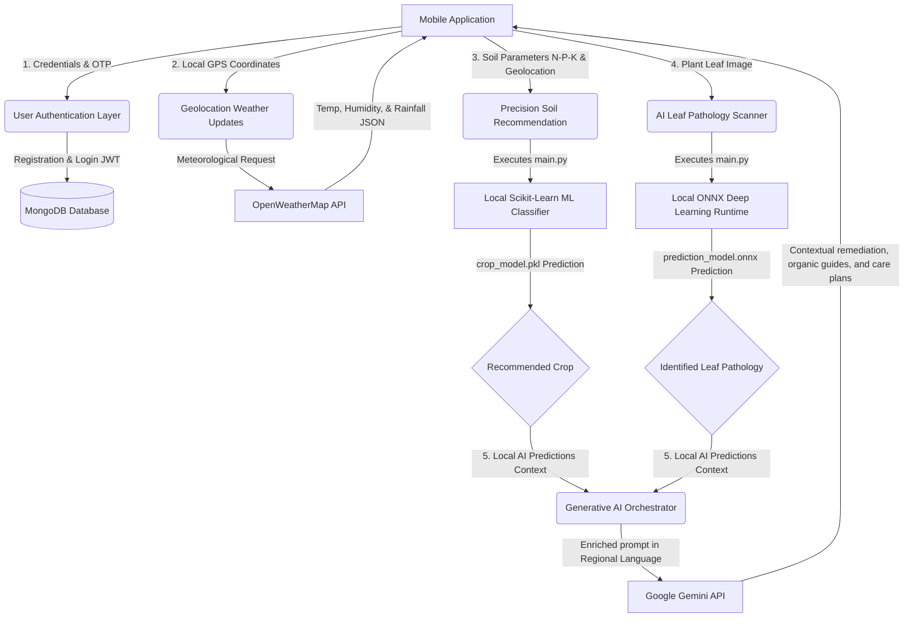

# AI, ML & LLM Integration Architecture (`Backend/python-services`)

This directory houses the machine learning classifiers, neural network inference runtimes, and Large Language Model (LLM) orchestration frameworks that power the core intelligence of AgriVision.

---

## AI Technical Stack

*   **Traditional ML Classifiers**: Scikit-Learn (`sklearn`), Pandas, NumPy
*   **Deep Learning Runtimes**: ONNX Runtime (Open Neural Network Exchange)
*   **Generative AI Orchestration**: Google Gemini API
*   **Third-Party API Integration**: OpenWeatherMap API (meteorological telemetry)
*   **Inter-Process Communication**: OS child streams (Node.js Express Server $\leftrightarrow$ Python Engine)

---

## System Data Flow (User Perspective)

The following diagram illustrates the precision agriculture ecosystem from the farmer's perspective, mapping how interactions originating in the mobile client route through local classification models and external API services:



---

## 1. Local Machine Learning Classifiers

AgriVision utilizes pre-trained classifiers to generate high-speed, local predictions:
*   **Crop Model Classifier (`crop_model.pkl`)**: Built with a Random Forest or Support Vector Machine (SVM) pipeline. It analyzes seven agricultural metrics:
    *   **N-P-K ratios**: Soil Nitrogen, Phosphorus, and Potassium (mg/kg).
    *   **Acidity**: Soil pH levels (0.0 to 14.0 scale).
    *   **Meteorological inputs**: Live temperature, humidity, and rainfall indicators.
*   **Disease Predictor (`prediction_model.onnx`)**: Uses a deep learning network exported to the **ONNX** format for cross-platform model portability and performant inferences on CPU/GPU via the ONNX Runtime library.
*   **Inference Loop**: Executed instantly by launching `main.py` via child processes. Because it runs locally, it executes within milliseconds and does not incur external API network fees.

---

## 2. Generative LLM Integration (Google Gemini API)

While traditional classification models are highly effective at outputting categorical values (e.g. diagnosing a plant condition as *Tomato Early Blight*), they lack the contextual language capabilities required to explain treatment pathways or answer conversational follow-up questions from farmers.

AgriVision integrates the **Google Gemini API** to expand local classifications into interactive farming solutions:

### A. Contextual Prompts Orchestration
Once the local ML/ONNX classifier outputs a diagnosis or crop label, the system formats a comprehensive prompt payload:
```python
def generate_llm_prompt(disease_label, plant_type, user_language):
    prompt = f"""
    The local AgriVision classifier diagnosed a {plant_type} plant leaf with {disease_label}.
    Provide a detailed, step-by-step biological remediation guide:
    1. Soil treatment parameters and chemical/organic fertilizer actions.
    2. Specific organic remedies (e.g. neem oil, composting) and safe chemical fungicides.
    3. Direct preventative steps for the upcoming seasonal cycle.
    
    Structure this as a clean, simple, bulleted guide in {user_language}.
    """
    return prompt
```

### B. Natural Language Conversational Assistant
*   **Interactive Dialogues**: Supports the mobile assistant console where farmers can ask contextual questions regarding irrigation schedules, fertilizer concentrations, and soil aeration cycles.
*   **Dynamic Contextual Adjustments**: Incorporates OpenWeatherMap forecasting variables inside Gemini queries (e.g., advising reduced watering actions during heavy atmospheric rain forecasts).

---

## 3. Geolocation & Weather APIs (`source/utils.py`)

To automate farming entries, the backend coordinates exchanges using the **OpenWeatherMap API**:
1.  The client transmits GPS coordinates (Latitude/Longitude).
2.  `source/utils.py` executes a remote call to the meteorological API endpoint.
3.  The response parses live climatic parameters:
    *   **Temperature** (`temp` in Kelvin/Celsius)
    *   **Relative Humidity** (`humidity` in %)
    *   **Rainfall Indicator** (Calculated from historical precipitation and cloud density trends)
4.  These parsed features are dynamically fed into the local Random Forest pickle model to make optimal crop recommendations.
