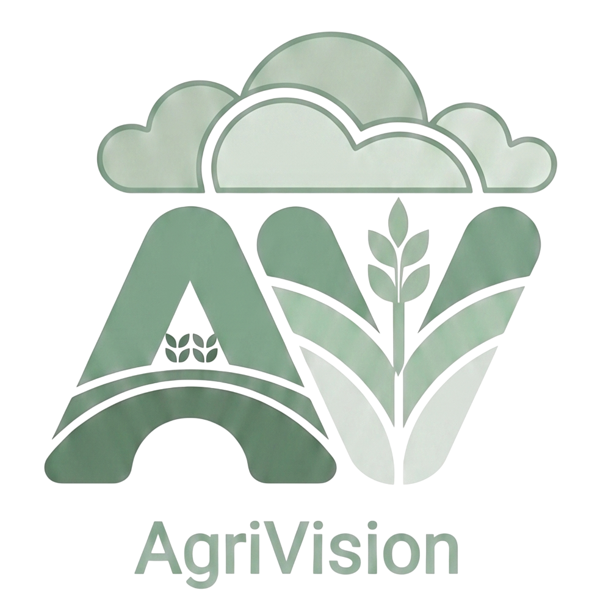

<p align="center">
  
</p>

<h1 align="center">AgriVision</h1>

<p align="center">
  <strong>AI-Powered Precision Agriculture Platform</strong><br/>
  An intelligent farming ecosystem leveraging Machine Learning, Mobile Diagnostics, and Web Visualizations.
</p>

<p align="center">
  <a href="#project-architecture">Architecture</a> •
  <a href="#key-capabilities">Features</a> •
  <a href="#quick-deployment">Setup</a>
</p>

---

## Introduction

**AgriVision** is a modern precision agriculture ecosystem built for the **Agri AI Hackathon - Abhisarga**. Designed to empower farmers and agricultural experts, AgriVision bridges advanced data science with actionable field tools. By analyzing location coordinates, real-time weather datasets, and leaf photographs, the platform delivers three core agricultural optimizations:
1.  **Crop & Fertilizer Recommendation**: Uses a machine learning model to suggest the most lucrative crops based on soil and local weather analytics.
2.  **Plant Disease Identification**: Image-based diagnostic engine designed to detect leaf pathologies and provide quick remedies.
3.  **Live Weather Orchestration**: Real-time climate forecasts tailored to GPS coordinates to aid daily agricultural operations.

---

## Project Architecture

The system is engineered as a decoupled, multi-module architecture:

```
AgriVision/
├── App/                # Mobile client written in Flutter
│   └── agrivision/     # Core Flutter package & localization assets
├── Backend/            # Node.js + TypeScript API Gateway
│   ├── config/         # DB & Environment variables config
│   ├── routes/         # Express REST routes (auth, predictions, soil)
│   ├── python-services/# Integrated Scikit-Learn crop intelligence
│   └── ...             # System middlewares & schemas
└── Webpage/            # Static product showcase & dashboard
```

For modular clarity, each directory contains a specialized `README.md` file:
*   **[Web landing page showcase](Webpage/README.md)**: Product description and visual layouts.
*   **[Mobile Application documentation](App/agrivision/README.md)**: Flutter client structure, themes, and screens.
*   **[Backend API Server documentation](Backend/README.md)**: Node/Express router, database, and system integration.
*   **[Machine Learning Service documentation](Backend/python-services/AgriVision/README.md)**: Training dataset, pickle model, and prediction modules.

---

## Key Capabilities

*   **Location-Aware Land Analytics**: Leverages GPS telemetry to fetch local soil and historical precipitation parameters.
*   **Deep Offline-First Themes**: Includes lightweight dark and light design models crafted using Flutter Provider.
*   **Multi-Lingual Localization**: Built-in support for multiple regional dialects, matching local demographic demands.
*   **Hybrid Node-Python Bridge**: A fast integration of Express APIs with local Python scripts via OS child streams.

---

## Quick Deployment

Ensure you have the following installed:
*   [Flutter SDK](https://docs.flutter.dev/get-started/install) (Mobile client)
*   [Node.js](https://nodejs.org/) v18+ & [MongoDB](https://www.mongodb.com/) (API layer)
*   [Python 3.9+](https://www.python.org/) (Inference engine)

### Step 1: Run the Backend
```bash
cd Backend
npm install
npm run dev
```

### Step 2: Set up Python ML Services
```bash
cd Backend/python-services/AgriVision
pip install -r requirements.txt
```

### Step 3: Run the Flutter Client
```bash
cd App/agrivision
flutter pub get
flutter run
```

### Step 4: Access Web Showcase
Open `Webpage/index.html` inside any web browser, or serve it:
```bash
cd Webpage
python -m http.server 8000
```

---

